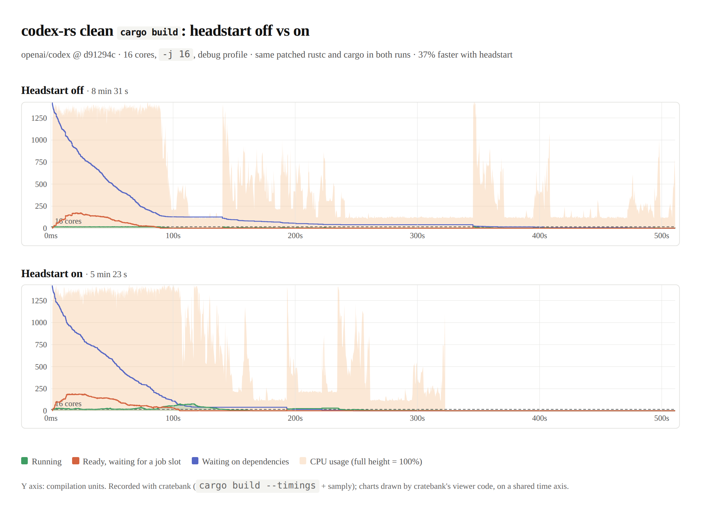
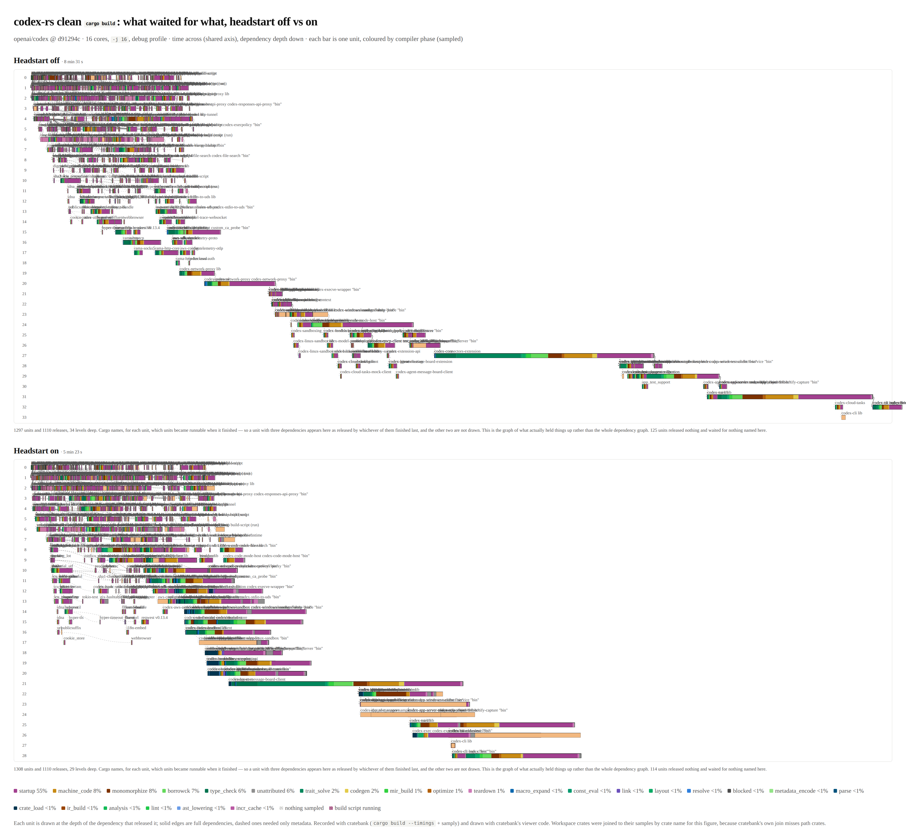

# headstart

Start dependent crates before their dependencies finish type-checking.

Every crate waits for the crates it depends on to be fully checked,
function bodies included, before it starts. It doesn't need those bodies
to type-check itself. It compiles against the dependency's interface, the
metadata in its `.rmeta` file.

Headstart makes rustc write an early metadata file as soon as the
interface is checked, and makes cargo start dependents on it. Each
crate's bodies are then checked while the crates downstream are already
compiling.

- **`cargo check`:** dependents run to completion on early metadata.
- **`cargo build`:** dependents do all their analysis on early metadata,
  then wait for the dependency's full metadata before generating code.
  While they wait, they give their job slot back.

If a body has an error, the build still fails with that error, with the
same diagnostics and exit status as today; only progress lines and the
cross-crate order of JSON messages can differ. Cargo reports a crate's
output only once all its dependencies have finished cleanly, and drops
it if one fails. The costs are work downstream that gets thrown away,
errors reported slightly later, and more memory in use at once (see
[docs/design.md](docs/design.md#risks)).

## Pieces

- **rustc, `-Zearly-metadata`** ([6 patches](patches/rustc)):
  - a new `analysis_interfaces` query splits analysis into item
    interfaces and function bodies;
  - the driver writes `.early-rmeta` between the two;
  - crate loading accepts early metadata, and swaps in full metadata
    before code generation, waiting for it if necessary on a lock its
    producer holds until it's written.
- **cargo, `-Zheadstart`** ([3 patches](patches/cargo)):
  - passes `-Zearly-metadata` to every compile;
  - starts dependents on the early-metadata notification, in both
    `check` and `build`;
  - gives a paused compilation's job slot to other work;
  - reports a crate's output only when its dependencies succeeded.

The patches are a commit series, each with a commit message and tests,
meant to become upstream pull requests: see
[patches/README.md](patches/README.md).

On rustc's default front end, headstart makes clean builds of 13 real
projects (rust-analyzer, zed, bevy, lemmy, polars and others) up to 54%
faster for `cargo check`, and up to 42% for `cargo build`. None is
slower. With the parallel front end (`-Zthreads=8`), which covers some
of the same ground, it adds up to 25%. Those are 16-core numbers. The
gain comes from cores the build would leave idle, so it shrinks on
smaller machines. On 4 cores, rust-analyzer's check is 24% faster and
its build 13–15%, and wide builds come out even.



A clean `cargo build` of [codex-rs](https://github.com/openai/codex) on
16 cores, recorded with
[cratebank](https://github.com/PowderworksCode/cratebank). Without
headstart, the workspace's own crates compile one after another while
the machine sits mostly idle; with it, each starts on the early metadata
of the one before, and the build is 37% faster.



The same two builds, with time across and dependency depth down: each
unit is drawn under the dependency that released it, coloured by compiler
phase. Without headstart the workspace crates form a long staircase; with
it they overlap. More in
[docs/results.md](docs/results.md#codex-rs-linux-amd-epyc-9554p-16-jobs-3-runs).

How it works, what early metadata leaves out, and the risks:
[docs/design.md](docs/design.md). Measurements:
[docs/results.md](docs/results.md). Whether it's ready to bring to the
compiler and cargo teams: [docs/readiness.md](docs/readiness.md).

## Try it

```sh
scripts/setup.sh    # check out rustc + cargo, apply the patches, build both
```

Then, in any Rust project:

```sh
RUSTC=/path/to/headstart/rustc/build/host/stage1/bin/rustc \
  /path/to/headstart/cargo/target/release/cargo check -Zheadstart   # or build
```

`CARGO_UNSTABLE_HEADSTART=true` turns it on too, as does `[unstable]
headstart = true` in `.cargo/config.toml`. Without it, the patched cargo
behaves like upstream, so the same binaries give a fair baseline.

`tests/smoke` is a two-crate workspace that shows the effect. Its `slow`
library takes several seconds to check, almost all of it in function
bodies. With headstart on, `app` starts about 0.2 s in instead of
waiting for `slow` to finish.

`scripts/check-errors.sh` checks the claim about errors on
`tests/errors`. It runs three scenarios (a clean build, an error in a
dependency, an error in the binary) with `cargo check` and `cargo build`,
headstart off and on. It then compares the human-readable output, the
JSON output, the exit status and what the built binary prints.

`scripts/check-incremental.sh [check|build]` does the same across a
sequence of incremental edits. The steps include adding an `impl Fn` a
dependent calls, and breaking and then fixing an interface. It also
compares the final state against a clean build.

`scripts/check-swap.sh` makes a library start on its dependency's early
metadata and swap in the full metadata while paused, at every
optimization level. The program built from it must print the same as one
built from full metadata.

`scripts/sweep.sh` builds all 53 rustc-perf compile benchmarks with
headstart off and on, with `-Zearly-metadata-verify`. It passes when every
build succeeds in both modes with the same diagnostics, and verify reports
nothing. `-c build` sweeps `cargo build`, `-r` the release profile, and
`-t` the parallel front end (`-Zthreads=8`).

## Benchmarks

```sh
scripts/bench.sh -n 5 [-c build] path/to/project ...
```

This times clean `cargo check` (or `cargo build`) builds, alternating
headstart off and on,
and prints the medians. A project can take cargo arguments after `::`
(`path/to/vaultwarden::--features=sqlite`). `scripts/real-projects.sh
<dir>` clones the 13 real projects from [docs/results.md](docs/results.md)
at the commits measured, and prints them in that form:

```sh
scripts/bench.sh -n 3 -c build $(scripts/real-projects.sh ~/hs-real)
```

`-w` adds an untimed warm-up build per project, for build scripts that do
one-time work outside `target` (helix compiles its grammars into its
source tree).

`scripts/bench-suite.sh <out-dir>` runs the whole suite of
[docs/results.md](docs/results.md) on the current machine: rust-analyzer,
the 21 rustc-perf benchmarks and the other real projects, check and build.
It keeps each benchmark's results separately and skips finished ones, so
it can be restarted, and writes a summary table at the end. It's how to
get the numbers for a machine size not measured yet, such as 8 cores.

`scripts/bench-mem.sh` samples the total memory of all rustc processes
during a build, in the project directory itself (run it on an otherwise
idle machine). `scripts/bench-incremental.sh` times incremental rechecks after
editing one function body. `scripts/log-rustc` records when each rustc run
started and ended, so you can see the schedule. The rustc-perf benchmarks
are under `rustc/src/tools/rustc-perf/collector/compile-benchmarks`
(`git -C rustc submodule update --init --depth 1 src/tools/rustc-perf`).
